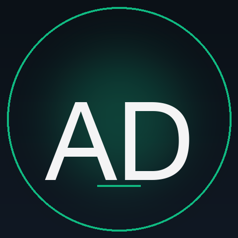

<!--
  README for github.com/aritrade — the GitHub profile landing page.
  Photo:    assets/avatar.png  (swap in a real LinkedIn export anytime)
  Avatar:   regenerable via `python3 assets/generate_avatar.py`
  Repo:     aritrade/aritrade (special profile-README repo)
-->

<table border="0" cellpadding="0" cellspacing="0" width="100%">
  <tr>
    <td width="200" valign="top" align="center">
      
    </td>
    <td valign="middle">
      <h1>Aritra De</h1>
      

        <strong>Strategic Customer Success Leader</strong> &nbsp;·&nbsp; <strong>AI Practitioner</strong> 
        <em>Driving product adoption, retention, and revenue growth across enterprise portfolios.</em>
      

      

        📍 Pune, India &nbsp;·&nbsp; 🏢 Currently at <strong>Nutanix</strong> &nbsp;·&nbsp; ✍️ Writing at <a href="https://medium.com/@decodedbyaritra">decodedbyaritra</a>
      

      

        
        
        
        
      

    </td>
  </tr>
</table>

> **10+ years** of enterprise customer impact &nbsp;·&nbsp; **Multi-million ARR** portfolio &nbsp;·&nbsp; Built across **VMware · Nutanix · Veeam · HPE · Unisys · Infosys**

---

## About

Strategic Customer Success leader with a decade-plus of experience translating complex enterprise products into measurable business outcomes. I own the post-sale arc end-to-end — adoption, expansion, retention, and executive trust — for multi-million ARR portfolios across data-center virtualization, hybrid cloud, and data protection.

My edge is the rare combination of **deep technical fluency** (VCIX-DCV, VCAP-DCV, Prometheus / PromQL, monitoring & observability) and **commercial accountability** (NRR, churn mitigation, expansion motion, exec QBRs). Lately I'm channeling both into hands-on **AI engineering** — shipping production-grade agentic experiences that turn AI from a buzzword into a customer outcome.

---

## Currently

- 🏢 **Customer Experience Manager** at **Nutanix** — owning the post-sale customer arc for strategic accounts.
- 🛠 **Building in public** — shipping production-grade agentic AI apps, content engines, and developer tooling on nights and weekends.
- ✍️ **Writing** at [decodedbyaritra](https://medium.com/@decodedbyaritra) on customer success, AI-native product, and the operator's playbook for the agentic era.

---

## Featured projects

<table border="0" cellpadding="10" cellspacing="0">
  <tr>
    <td valign="top" width="50%">
      <h3>🩺 &nbsp;<a href="https://github.com/aritrade/intimacy-and-sex-therapy-library">intimacy-and-sex-therapy-library</a></h3>
      

        
        
        
        
        
      

      

        A clinician-reviewed, evidence-grounded learning platform with an <strong>autonomous short-form video engine</strong> publishing daily to Instagram, YouTube, and Facebook — <strong>DPDP + GDPR baked in</strong>. RAG with hybrid BM25 + pgvector, Remotion + Edge TTS render pipeline, fully Mac-free operation via GH Actions.
      

      

        
        &nbsp;
        
      

    </td>
    <td valign="top" width="50%">
      <h3>🤖 &nbsp;<a href="https://github.com/aritrade/ai-survival-score">ai-survival-score</a></h3>
      

        
        
        
        
      

      

        An <strong>agentic AI career displacement analyzer</strong> built with Antigravity 2.0 + Gemini 3.5 Flash. Three parallel agents — <em>Profile DNA, Risk Modeling, Upskilling</em> — collapse the build loop <strong>~12×</strong>. 100% local-first inference, no backend, drop-in LinkedIn PDF.
      

      

        
        &nbsp;
        
      

    </td>
  </tr>
  <tr>
    <td valign="top" width="50%">
      <h3>📝 &nbsp;<a href="https://github.com/aritrade/notepad-plus-mac">notepad-plus-mac</a></h3>
      

        
        
        
        
      

      

        <strong>NotepadNext</strong> — a full-featured Notepad++ for macOS built on Electron + Monaco. <strong>50+ language syntax</strong>, multi-cursor, macros, split view, signed <code>.dmg</code> releases. The native Mac editor Notepad++ users always wanted.
      

      

        
        &nbsp;
        
      

    </td>
    <td valign="top" width="50%">
      <h3>⚡ &nbsp;<a href="https://github.com/aritrade/productiveyou">productiveyou</a> · Monk Mode Activated</h3>
      

        
        
        
        
        
      

      

        A <strong>2-year monk-mode operating system</strong> — non-negotiables + habits + multi-modal journal + 2-year streak grid + Wrapped-style year-end recap. Forgiving streaks (no shame-spirals), installable PWA on every device, plus a companion Chrome extension that turns every new tab into a discipline checkpoint.
      

      

        
        &nbsp;
        
      

    </td>
  </tr>
</table>

---

## Career highlights

| | |
|---|---|
| 📈 | **Multi-million ARR** enterprise portfolio under direct ownership |
| 🏆 | **Top Performer — Q2 FY20** at VMware |
| 🌐 | **3 yrs at VMware** (Sysops → Senior Sysops → Escalation Engineer) before stepping into customer-facing leadership |
| 🤝 | Currently driving **post-sale outcomes at Nutanix** after a successful technical onboarding tenure at **Veeam** |
| 🧭 | Operator's arc: **Infosys → Unisys → HPE → VMware → Nutanix → Veeam → Nutanix** |
| 🌏 | Trilingual operator: **English** (professional), **Bengali** (native), **Hindi** (professional) |

---

## Certifications & programs

| Credential | Issuer | Year |
|---|---|---|
| **VMware Certified Implementation Expert — Data Center Virtualization (VCIX-DCV)** | VMware (Broadcom) | 2023 |
| **VMware Certified Advanced Professional — Data Center Virtualization Deploy (VCAP-DCV Deploy)** | VMware (Broadcom) | 2023 |
| **Product Leadership Program** | Institute of Product Leadership | 2023 |
| **The Fundamentals of Digital Marketing** | Google Digital Garage | — |

**Top skills:** Prometheus · PromQL · Monitoring & Observability · Customer Success · Enterprise Onboarding · Technical Account Management · Product Strategy

---

## Voices

A growing wall of recommendations from **leaders, peers, and enterprise customers** I've shipped alongside over the past decade. The full set lives on LinkedIn — featured pulls will surface here as they accumulate.

  
  &nbsp;
  

<!--
  ─────────────────────────────────────────────────────────────────────────
  TEMPLATE — paste new recommendations here. Drop a <tr>...</tr> per row
  and the 2×2 grid renders automatically. Uncomment the <table> block
  below and the centered CTA above gets promoted to a footer link.
  ─────────────────────────────────────────────────────────────────────────

<table border="0" cellpadding="14" cellspacing="0" width="100%">
  <tr>
    <td valign="top" width="50%">
      <blockquote>
        <strong>"</strong>Paste the recommendation text here. Keep it to 2–4 sentences for grid balance.<strong>"</strong>
      </blockquote>
      

        — <strong>Author Name</strong> · Their Title @ Company · <em>Month YYYY</em> 
        <a href="https://www.linkedin.com/in/their-handle/">linkedin.com/in/their-handle</a>
      

    </td>
    <td valign="top" width="50%">
      <blockquote>
        <strong>"</strong>Second recommendation text here.<strong>"</strong>
      </blockquote>
      

        — <strong>Author Name</strong> · Their Title @ Company · <em>Month YYYY</em> 
        <a href="https://www.linkedin.com/in/their-handle/">linkedin.com/in/their-handle</a>
      

    </td>
  </tr>
  <tr>
    <td valign="top" width="50%">
      <blockquote>
        <strong>"</strong>Third recommendation text.<strong>"</strong>
      </blockquote>
      

        — <strong>Author Name</strong> · Their Title @ Company · <em>Month YYYY</em>
      

    </td>
    <td valign="top" width="50%">
      <blockquote>
        <strong>"</strong>Fourth recommendation text.<strong>"</strong>
      </blockquote>
      

        — <strong>Author Name</strong> · Their Title @ Company · <em>Month YYYY</em>
      

    </td>
  </tr>
</table>

  Optional: promote one to a centered hero quote above the grid using:

  <em>"Your strongest single-line pull-quote here."</em> 
  — <strong>Author</strong> · Their Title @ Company

-->

---

## Writing

I write at [**Medium · decodedbyaritra**](https://medium.com/@decodedbyaritra) on the intersection of **customer success**, **AI-native product**, and the **operator's playbook** for the agentic era. A few pieces worth your time:

<table border="0" cellpadding="10" cellspacing="0">
  <tr>
    <td valign="top" width="50%">
      <h3>📊 &nbsp;<a href="https://medium.com/@decodedbyaritra/reflecting-on-one-year-at-nutanix-a-journey-of-growth-learning-and-gratitude-cb092c89593b">Reflecting on One Year at Nutanix</a></h3>
      

        
        
        
        
      

      

        A year-end retrospective on stepping into the <strong>Senior Technical Account Manager</strong> role at Nutanix — owning two of India's largest BFSI accounts, the shift from break-fix support to proactive technical strategy, mentoring an intern cohort, and the Bangkok Professional Services offsite that crystallised what good cross-team CS looks like.
      

      

        
      

    </td>
    <td valign="top" width="50%">
      <h3>🤝 &nbsp;<a href="https://medium.com/@decodedbyaritra/my-first-quarterly-business-review-a-journey-of-connection-and-insight-aa9bac4433c6">My First Quarterly Business Review</a></h3>
      

        
        
        
        
      

      

        A field report from a TAM's <strong>first in-person QBR with two enterprise BFSI customers</strong> — preparing the deck, navigating preconceived notions, pitching new product capabilities, and the lesson that the rapport in the room always outweighs the rapport on the slide.
      

      

        
      

    </td>
  </tr>
</table>

  

---

## Let's connect

I'm always up for a conversation with operators building **enterprise CS programs**, **AI-native product teams**, and **founders** thinking about agentic workflows.

| | |
|---|---|
| 💼 **LinkedIn** | [linkedin.com/in/itsmearitrade](https://www.linkedin.com/in/itsmearitrade/) |
| 🐦 **X / Twitter** | [@AritraThinks](https://x.com/AritraThinks) |
| ✍️ **Medium** | [@decodedbyaritra](https://medium.com/@decodedbyaritra) |
| ✉️ **Email** | [de.aritrade.aritra@gmail.com](mailto:de.aritrade.aritra@gmail.com) |
| 💻 **GitHub** | [@aritrade](https://github.com/aritrade) |

---

### Philosophy

> **Outwork the doubt. Out-deliver the brief. Compound the trust.**

This profile is generated and maintained from <a href="https://github.com/aritrade/aritrade">github.com/aritrade/aritrade</a>. The avatar is a regenerable monogram — swap <code>assets/avatar.png</code> with a real photo any time.

